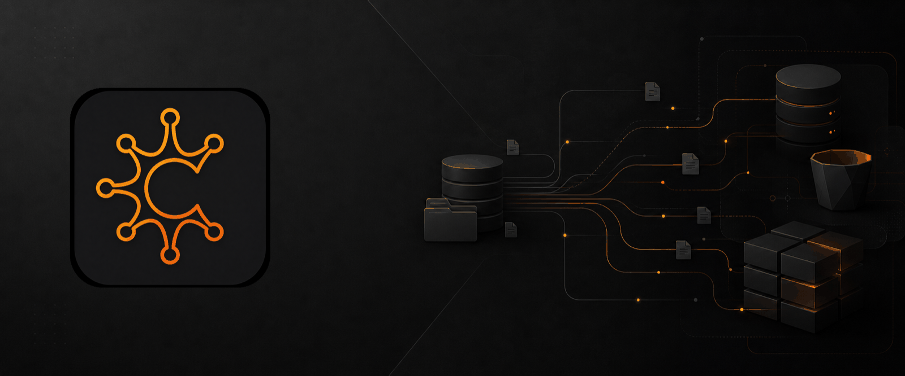
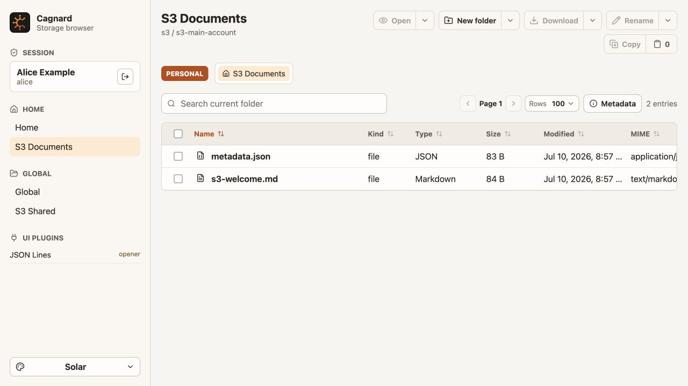

<p align="center">
  
</p>

# Cagnard

[](https://github.com/k3rnL/cagnard/actions/workflows/validate.yml)
[](https://github.com/k3rnL/cagnard/releases/latest)

**Built in Occitania for files that live everywhere.**

Cagnard is a self-hosted storage browser that gives Unix filesystems and S3-compatible object storage one modern, capability-aware interface. Browse, open, search, upload, download, rename, delete, and stream files between providers without exposing storage credentials to the browser.

## Why Cagnard

- **One browser across providers.** Storage roots share a normalized contract while keeping provider-specific metadata and degraded-operation notices visible.
- **Cross-provider transfers.** A tab-synchronized pasteboard, recursive tasks, conflict resolution, streaming, progress, cancellation, and per-file detail make copy and move practical.
- **Useful file opening.** Text, Markdown, JSON, YAML, Parquet, Avro, Arrow, NDJSON, CSV, diffs, logs, media, PDF, and archives open in the application with bounded or range-based reads.
- **Stateless operation.** One HOCON file defines users, access rules, providers, accounts, roots, and appearance; no application database is required.
- **Personal and shared spaces.** Users can receive one or more personal homes alongside administrator-controlled global roots.
- **Operator-controlled appearance.** Classic and Solar palettes each include light, dark, and live system modes, with optional user overrides.

<p align="center">
  
</p>

## Quick Start

### Docker Compose

Run the released filesystem demo; Go and Node.js are not required:

```bash
git clone https://github.com/k3rnL/cagnard.git
cd cagnard/examples/run/local-filesystem-static
cp .env.example .env
docker compose up -d
```

Open [http://127.0.0.1:5173](http://127.0.0.1:5173) and sign in with `alice` / `cagnard`. The [Docker guide](docs/getting-started/docker.md) also covers the MinIO and combined-provider examples, version selection, source builds, and cleanup.

The default path pulls from GHCR. If registry policy returns `401`, the package owner must make the release packages public or grant your account read access; the Docker guide includes an immediate source-build fallback.

### Helm

```bash
curl -fsSLo cagnard-demo-values.yaml \
  https://raw.githubusercontent.com/k3rnL/cagnard/v0.6.2/deploy/helm/cagnard/examples/local-filesystem-static-values.yaml

helm install cagnard oci://ghcr.io/k3rnl/charts/cagnard \
  --version 0.6.2 \
  -f cagnard-demo-values.yaml

kubectl port-forward service/cagnard-frontend 5173:80
```

The [Helm guide](docs/getting-started/helm.md) explains production adaptation, secret-backed configuration, ingress, upgrades, and cleanup.

## Supported Today

| Area | Implemented |
| --- | --- |
| Storage providers | Unix filesystem, AWS S3 and compatible endpoints including MinIO |
| Authentication | Static configured users and explicit local development mode |
| Storage access | Multiple accounts, personal/global roots, user/role/group rules, read-only accounts |
| Browser | Provider pagination, backend search/sort, metadata, multi-select, upload/download, rename/delete |
| Transfers | Cross-provider files and directories, streams, conflict policies, task queue, progress and cancellation |
| File experiences | Text/source editing, Markdown, JSON/YAML, read-only Parquet/Avro/Arrow/NDJSON/CSV/TSV inspection, logs, diffs, media, PDF, archives |
| Deployment | Release images, Docker Compose examples, OCI Helm chart, GitHub release automation |

OIDC declarations reserve the future SSO contract, but end-to-end OIDC login is not yet production-ready. Active background tasks are currently process-local and are lost when the backend restarts. These limits are documented rather than hidden.

## Configuration And Extension

Providers, accounts, roots, users, access rules, and themes live in HOCON. Start from [`config/cagnard.example.conf`](config/cagnard.example.conf), then use the [configuration guide](docs/operations/configuration.md) and [field reference](docs/reference/configuration.md).

Storage implementations advertise supported, degraded, and unsupported capabilities. Maintained file openers ship in a typed first-party frontend registry and use scoped Cagnard content APIs without provider credentials. Read the [architecture overview](docs/architecture/overview.md), [storage provider contract](docs/architecture/storage-plugins.md), and [file opener architecture](docs/architecture/file-openers.md) before extending them.

## Documentation

- [Documentation portal](docs/README.md)
- [Docker quick start](docs/getting-started/docker.md)
- [Helm quick start](docs/getting-started/helm.md)
- [Browsing and transfers](docs/guides/browsing-and-transfers.md)
- [S3-compatible storage and MinIO](docs/guides/s3-and-minio.md)
- [Deployment and security](docs/operations/deployment.md)
- [Development setup](docs/getting-started/development.md)

Engineering behavior contracts and active changes live under [`openspec/`](openspec/). Reader documentation is maintained by user goal under [`docs/`](docs/README.md).

## Develop

Cagnard uses a Go backend and a Vite/React frontend. With Go, Node.js 22.13+, and pnpm 11.7.0 installed:

```bash
pnpm install
pnpm check
```

See [Development setup](docs/getting-started/development.md), [Testing and validation](docs/contributing/testing.md), and [Documentation maintenance](docs/contributing/documentation.md).
