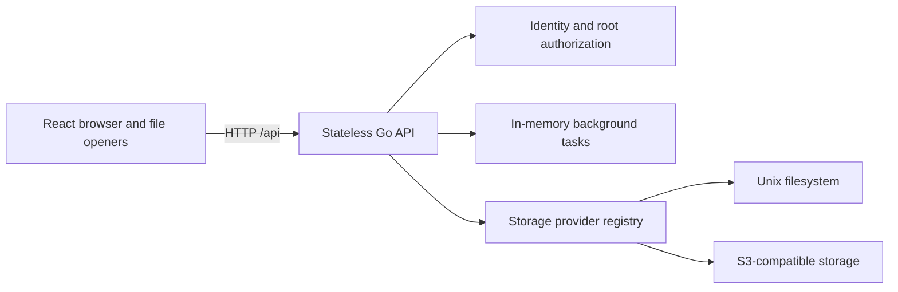

# Architecture Overview

Cagnard is a browser application over an abstract storage contract. The React frontend never talks directly to S3 or the host filesystem; it calls one Go HTTP backend that resolves identity, access, provider capabilities, and file operations from HOCON configuration.

## Stateless Runtime

On startup, the backend parses one configuration into typed providers, accounts, users, roots, and appearance defaults. Requests authenticate a signed cookie or explicit development identity, resolve the current user against configuration, then filter roots by user, role, and group.

There is no application database. This makes deployment and backup simple, but active copy, move, delete, download, and upload tasks are an explicit exception: they are process-local and disappear on restart.

## Root Identity

A file location is not only a path. Every operation carries:

- tunnel (`personal` or `global`);
- storage root ID;
- provider and account resolved by the server;
- path relative to that root.

The browser URL stores readable navigation paths while API requests preserve root identity. Provider credentials and absolute filesystem paths remain server-side.

## Capability Negotiation

Providers expose supported, degraded, or unsupported capabilities. Roots and entries return that state to the frontend, which uses it to enable actions and select compatible file openers. This allows provider-specific strength without turning the entire UI into an S3 or filesystem UI.

See [Storage providers](storage-plugins.md) and the [capability reference](../reference/provider-capabilities.md).

## Data Paths

Small direct operations can use bounded buffers. Downloads, uploads, range-based viewers, and cross-provider transfers use stream or range interfaces when available. Recursive copy, move, and delete report child entries through the common task queue; streamed downloads and browser-fed uploads use the same lifecycle and cancellation model.

## Extension Boundaries

Storage providers implement the server-side storage interface and advertise capabilities. A typed first-party registry maps MIME types, extensions, categories, size strategies, and required capabilities to lazy frontend rendering surfaces. Neither model gives browser code provider credentials.

Both provider implementations and file openers are currently compiled into the application. Specialized structured-data readers run in a worker and use authorized Cagnard content URLs. A future executable plugin system would need an explicit packaging, versioning, trust, and isolation design; the removed manifest-only frontend contract is not retained as a public API.
