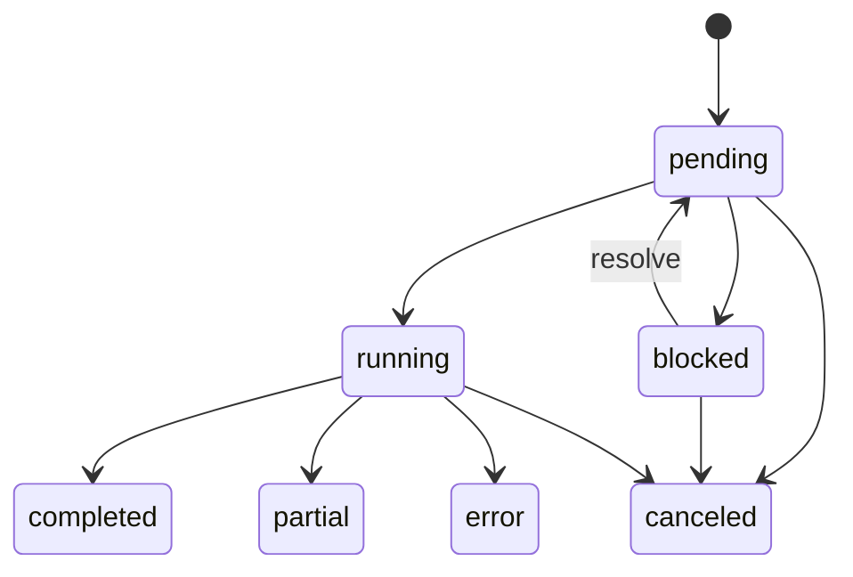

# Background Task Architecture

Cagnard runs copy, move, delete, download, and upload through one owner-scoped task manager. A task keeps the same ID from creation through conflict resolution and execution, so polling and UI actions cannot create duplicate queue entries.

## Lifecycle

- `pending`: accepted, waiting for a worker or browser stream.
- `blocked`: waiting for a conflict decision.
- `running`: provider or browser I/O is active.
- `completed`: every eligible item finished.
- `partial`: useful mutations or delivery completed, but one or more items failed.
- `error`: no successful outcome could be completed.
- `canceled`: no new work starts; already completed mutations remain.

Every response carries a stable ID, monotonically increasing revision, timestamps, operation, aggregate progress, mutation count, initiating location, and paginated affected items. Terminal tasks are retained for one hour and can be cleared explicitly.

## Execution Shapes

Copy, move, and delete are backend-run tasks. Provider operations receive a cancellable context, and eligible selected items use the configured concurrency limit.

Downloads are response-stream tasks. Creation returns an authenticated content URL and leaves the task pending. Consuming that URL streams one file directly or writes a ZIP incrementally for mixed files and folders. A ZIP is not built in temporary storage and cannot be resumed.

Uploads are browser-fed tasks. The browser first submits a safe relative-path manifest, resolves conflicts once on the original task, then streams each file to a stable item endpoint with bounded concurrency. Explicit empty directories are supported when the browser supplies them.

## Details And Progress

Affected items use stable IDs and a flat parent-linked index. `GET /api/tasks/{id}/items` returns an opaque page reference, hierarchy-preserving state/name ordering, parent ID, and depth. Selected directories are represented once as hierarchy roots rather than repeated as provider-reported children. Aggregate progress remains on the task response and does not require loading every item.

Byte progress means provider bytes read or accepted. Download tasks additionally report bytes delivered to the browser. ZIP delivery totals remain unknown because compression changes the wire size. Unknown provider sizes use item progress until byte totals become available.

## Cancellation And Partial Results

Cancellation is cooperative. Active filesystem handles and S3 requests are closed through context cancellation. S3 multipart uploads are aborted. A disconnected browser response or upload request becomes a safe task error unless the user explicitly canceled it.

Delete is irreversible: descendants removed before cancellation stay removed. Move deletes a source only after its destination copy succeeds. UI refresh uses the task's exact initiating tunnel, root, and path and occurs only for a new terminal revision with a positive mutation count.

## Configuration And Durability

`tasks.maxConcurrentItems` defaults to `4`. If absent, the deprecated `tasks.maxConcurrentTransfers` value remains a compatibility fallback. ZIP file reads are sequential to preserve deterministic archive order and bounded memory.

The manager is process-local and in memory. Restarting the backend loses active tasks and retained history. Multiple replicas do not share task URLs, upload manifests, conflict decisions, or progress. Use one backend replica or session affinity until a durable task store is introduced.
