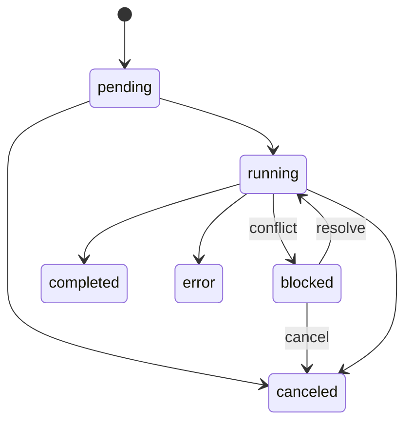

# Transfer Task Engine

Copy and move are asynchronous backend tasks. One accepted request keeps one task identity through pending, conflict resolution, execution, and terminal history; resolving a conflict does not create a second visible task.

## State Model

- `pending`: accepted and waiting for a worker.
- `blocked`: waiting for a user conflict decision.
- `running`: transferring and reporting byte/item progress.
- `completed`: destination work succeeded; move source deletion also succeeded.
- `canceled`: canceled explicitly or conflict resolution was abandoned.
- `error`: execution failed with a user-safe message; administrative detail is logged server-side.

Terminal tasks remain available for one hour and can also be cleared explicitly.

## Planning And Details

Directory tasks are recursively represented by affected child entries rather than only the selected folder. The task summary reports aggregate items and bytes. Expanded details are paginated so large trees do not produce unbounded responses. Running items sort before completed items, then by name.

## Concurrency

`tasks.maxConcurrentTransfers` controls concurrent transfer work and defaults to `4`. Increase it only after testing provider throttling, backend memory, network bandwidth, and destination behavior.

## Progress

Stream callbacks increment transferred bytes as data moves. The UI polls rapidly immediately after task creation, then backs off as state stabilizes. Reloading the page retrieves retained task summaries and details from the backend, including completed sizes while the process remains alive.

## Conflict Policy

Conflicts block the original task. The user can keep both, replace, skip, or cancel, and a batch decision can apply to nested conflicts discovered later. Keep-both allocates an available name at the destination. Replace is explicit.

## Cancellation And Failure

Cancellation is cooperative: no new child work starts, active provider calls stop where their interfaces permit it, and already completed destination writes remain. Cross-provider move deletes each source only after its destination copy succeeds. If source deletion fails, the destination remains and the task reports the partial outcome.

## Durability Limit

The queue is in-memory. Backend restart or failover loses task history, conflict prompts, and progress state. A future durable implementation must preserve task IDs, authorization context, conflict decisions, pagination, and idempotent provider operations before multiple active backend replicas can share work safely.
